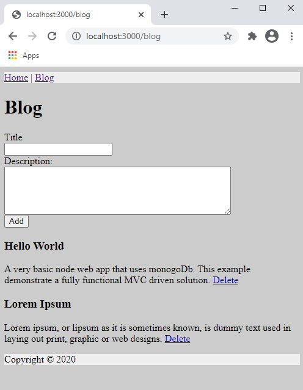

# node-mongo-app
A very basic node web app that uses mongoDb. This example demonstrate a fully functional MVC driven solution. 

## Local setup
1. Install all the node packages.

``` npm install ```

2. Spin up docker containers for mongoDb and mongo-express (Web-based MongoDB admin interface).

``` docker-compose up --build ```

3. Connect to mongo client with root access to admin db
``` 
docker exec -it mongodb bash 
mongo -u root -p example --authenticationDatabase admin 
```

4. Create a database

``` use mydatabase ```

5. Create a user and assign read write role to mydatabase
```
db.createUser(
    {
        user: "lorem",
        pwd: "ipsum",
        roles: [
            { role: "readWrite", db: "mydatabase" }
        ]
    }
)
```

6. Run the node app

``` nodemon app ```




Enjoy!


